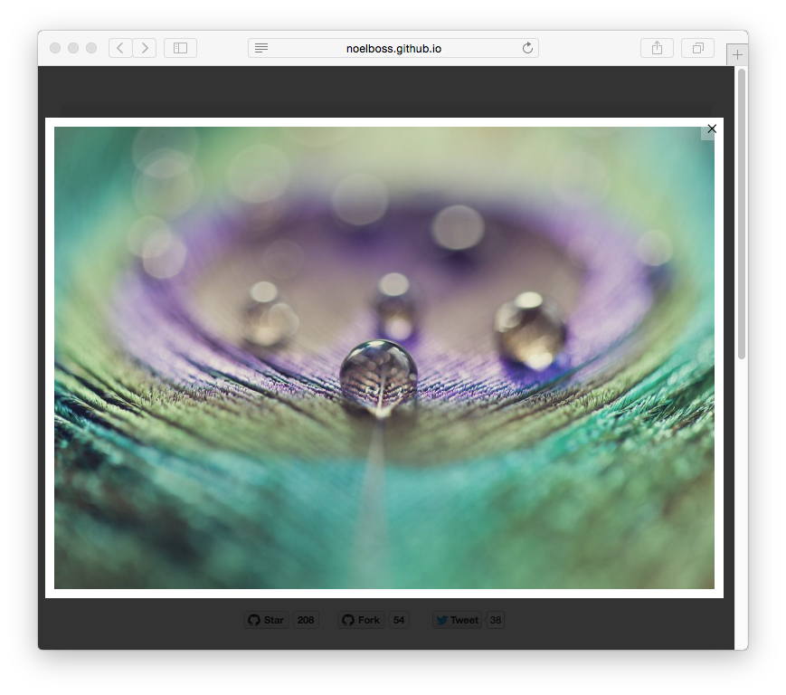

# Grav Featherlight Plugin



`featherlight` is a simple [Grav](http://github.com/getgrav/grav) plugin that adds **lightbox** functionality via the jQuery plugin [Featherlight.js](http://noelboss.github.io/featherlight/).

# Installation

Installing the Featherlight plugin can be done in one of two ways. Our GPM (Grav Package Manager) installation method enables you to quickly and easily install the plugin with a simple terminal command, while the manual method enables you to do so via a zip file.

## GPM Installation (Preferred)

The simplest way to install this plugin is via the [Grav Package Manager (GPM)](http://learn.getgrav.org/advanced/grav-gpm) through your system's Terminal (also called the command line).  From the root of your Grav install type:

    bin/gpm install featherlight

This will install the Featherlight plugin into your `/user/plugins` directory within Grav. Its files can be found under `/your/site/grav/user/plugins/featherlight`.

## Manual Installation

To install this plugin, just download the zip version of this repository and unzip it under `/your/site/grav/user/plugins`. Then, rename the folder to `featherlight`. You can find these files either on [GitHub](https://github.com/getgrav/grav-plugin-featherlight) or via [GetGrav.org](http://getgrav.org/downloads/plugins#extras).

You should now have all the plugin files under

    /your/site/grav/user/plugins/featherlight

>> NOTE: This plugin is a modular component for Grav which requires [Grav](http://github.com/getgrav/grav) to function

# Usage

To best understand how Featherlight works, you should read through the original project [documentation](https://github.com/noelboss/featherlight/#installation).

Featherlight is **enabled** but **not active** by default.  You can change this behavior by setting `active: true` in the plugin's configuration.  Simply copy the `user/plugins/featherlight/featherlight.yaml` into `user/config/plugins/featherlight.yaml` and make your modifications.

```
enabled: true                 # global enable/disable the entire plugin
active: false                 # if the plugin is active and JS/CSS should be loaded
openSpeed: 250                # open speed in ms
closeSpeed: 250               # close speed in ms
closeOnClick: background      # background|anywhere|false
closeOnEsc: true              # true|false on hitting Esc key
```

You can also override any default setings from the page headers:

eg:

    ---
    title: Sample Code With Custom Settings
    featherlight:
        active: true
        openSpeed: 100
        closeSpeed: 100
    ---


You can also enable globally in the `yaml`, but disable featherlighting for a particular page:

    ---
    title: Sample Code with Featherlight disabled
    featherlight:
        enabled: false
    ---

# Updating

As development for the Featherlight plugin continues, new versions may become available that add additional features and functionality, improve compatibility with newer Grav releases, and generally provide a better user experience. Updating Featherlight is easy, and can be done through Grav's GPM system, as well as manually.

## GPM Update (Preferred)

The simplest way to update this plugin is via the [Grav Package Manager (GPM)](http://learn.getgrav.org/advanced/grav-gpm). You can do this with this by navigating to the root directory of your Grav install using your system's Terminal (also called command line) and typing the following:

    bin/gpm update featherlight

This command will check your Grav install to see if your Featherlight plugin is due for an update. If a newer release is found, you will be asked whether or not you wish to update. To continue, type `y` and hit enter. The plugin will automatically update and clear Grav's cache.

## Manual Update

Manually updating Featherlight is pretty simple. Here is what you will need to do to get this done:

* Delete the `your/site/user/plugins/featherlight` directory.
* Download the new version of the Featherlight plugin from either [GitHub](https://github.com/getgrav/grav-plugin-featherlight) or [GetGrav.org](http://getgrav.org/downloads/plugins#extras).
* Unzip the zip file in `your/site/user/plugins` and rename the resulting folder to `featherlight`.
* Clear the Grav cache. The simplest way to do this is by going to the root Grav directory in terminal and typing `bin/grav clear-cache`.

> Note: Any changes you have made to any of the files listed under this directory will also be removed and replaced by the new set. Any files located elsewhere (for example a YAML settings file placed in `user/config/plugins`) will remain intact.
